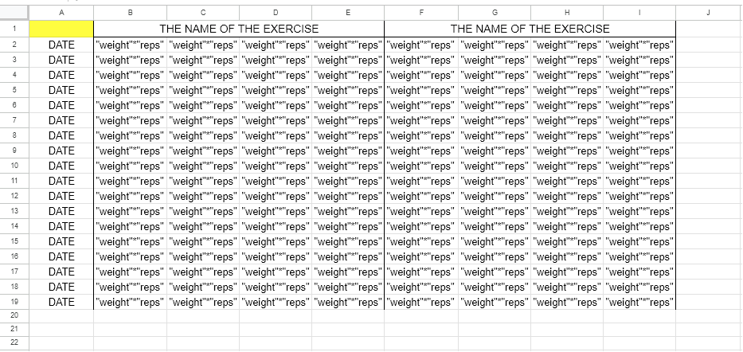
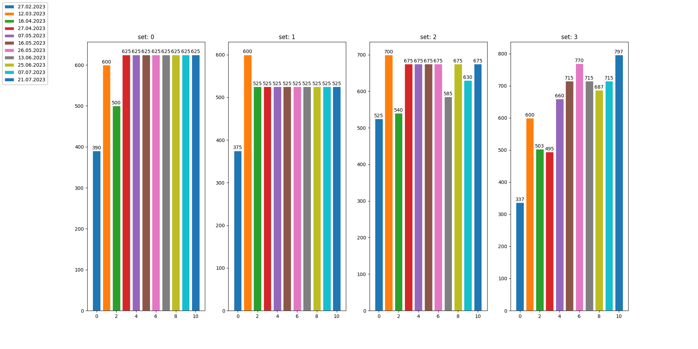

<h1>WO_process_manager</h1>

Makes figures from excel sheets with WO data sets.

You can use the program for your own good if you have the same Excel sheet structure as it has in <a href="https://docs.google.com/spreadsheets/d/1b0plqR5RodygHOkzW2pEYDcle3SSPAS-0mcqIkvEljg/edit?usp=sharing">mine</a>.

Also the example of what and how it has to look like you can find on this image below

<a href="https://docs.google.com/spreadsheets/d/1Ac2p3Orvo-E8JtQ_Ymrg-90XvT4fWNxYOLcpQtO4G6I/edit?usp=sharing">And also here</a>

 
The result will be something like that

  Work still in progress!

